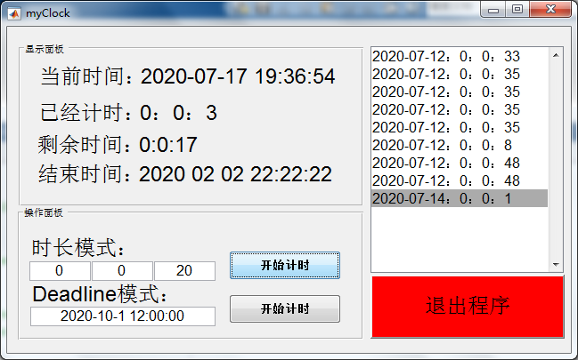
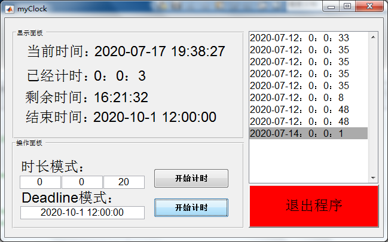

DEMO
===========================

##  环境依赖
MATLAB1016a

##  部署步骤
1. 加入工作目录

2. myClock.m


##  目录结构描述


##  关键代码
```c
% --- 方法一的计时启动按钮.
function pushbutton1_Callback(hObject, eventdata, handles)
% hObject    handle to pushbutton1 (see GCBO)
% eventdata  reserved - to be defined in a future version of MATLAB
% handles    structure with handles and user data (see GUIDATA)
% 获取输入值
a=str2num(get(handles.edit1,'string'));
b=str2num(get(handles.edit2,'string'));
c=str2num(get(handles.edit3,'string'));
mytime=[a;b;c]
Alltime=mytime(1)*60*60+mytime(2)*60+mytime(3);
Alltime1=Alltime;
startFlag=true;
timeMouse=0;
x=0;y=0;
while(Alltime>0) 
    set(handles.text29,'string',datestr(datetime,'yyyy-mm-dd HH:MM:SS')); % 当前时间
    if startFlag
        Alltime=Alltime-1;
        Lefttime=Alltime;
        LeftSeconds=floor(rem(Lefttime,60));
        LeftMinutes=floor(rem(Lefttime/60,60));
        LeftHours=floor(rem(Lefttime/(60*60),60));
        r=sprintf('剩余时间:%d时%d分%d秒',LeftHours,LeftMinutes,LeftSeconds);
        rr=sprintf('%d:%d:%d',LeftHours,LeftMinutes,LeftSeconds);
        disp(r)   
        %计算剩余时间        
        leaveTime=Alltime1-Alltime;
        LeftSeconds1=floor(rem(leaveTime,60));
        LeftMinutes1=floor(rem(leaveTime/60,60));
        LeftHours1=floor(rem(leaveTime/(60*60),60));
        rrr=sprintf('%d：%d：%d',LeftHours1,LeftMinutes1,LeftSeconds1);
        % GUI显示
        set(handles.text31,'string',rrr);  % 已经计时
        set(handles.text33,'string',rr); % 剩余时间
    else
%         disp('.')
    end
    %判断鼠标状态    
    p=get(0,'PointerLocation');
    %检测到鼠标位置未移动
    if x==p(1) && y==p(2)  
        timeMouse=timeMouse+1
        x=p(1);
        y=p(2);
        if timeMouse>=5
            startFlag=false
            disp('用户已离开');     
            timeMouse=0;
        end
    else
        disp('用户已回归');     
        x=p(1);
        y=p(2);
        startFlag=true;
    end
	pause(1);
end
%文本按一列存储
fp=fopen('1.txt','a'); % 1.txt'为文件名；'w'为打开方式：会清空原本的数据，重新写入。
%按列写入
fprintf(fp,'%s：%s\n',datestr(datetime,'yyyy-mm-dd'),rrr);
fclose(fp);            % 关闭文件。
show(mytime)
```

```c
% --- deadline 模式倒计时
function pushbutton4_Callback(hObject, eventdata, handles)
% hObject    handle to pushbutton4 (see GCBO)
% eventdata  reserved - to be defined in a future version of MATLAB
% handles    structure with handles and user data (see GUIDATA)
global Starttime
global Endtime
global InfoStr
global PassInfoStr
global startFlag
set(handles.text35,'string',get(handles.edit4,'string'));
x=datestr(get(handles.edit4,'string'),'yyyy mm dd HH MM ss ');
y=datestr(datetime,'yyyy mm dd HH MM SS');
Starttime=[str2num(y(1:4)),str2num(y(6:7)), str2num(y(9:10)), str2num(y(12:13)), str2num(y(15:16)), str2num(y(18:19))];
Endtime=[str2num(x(1:4)),str2num(x(6:7)), str2num(x(9:10)), str2num(x(12:13)), str2num(x(15:16)), str2num(x(18:19))];
t = timer('StartDelay', 0,'Period',1,'TasksToExecute', 10000,...
          'ExecutionMode','fixedRate');
t.TimerFcn = {@mycallback};
start(t)
startFlag=true;
% 也可以在这个while里通过比对时间来完成定时
while(true)  
    %disp(datetime);
    if(~startFlag)
        %文本按一列存储
        fp=fopen('1.txt','a'); % 1.txt'为文件名；'w'为打开方式：会清空原本的数据，重新写入。
        %按列写入
        fprintf(fp,'%s：%s\n',datestr(datetime,'yyyy-mm-dd'),PassInfoStr);
        fclose(fp);            % 关闭文件。
%         show(mytime)
        break;
    end
    set(handles.text31,'string',PassInfoStr);
    set(handles.text29,'string',datestr(datetime,'yyyy-mm-dd HH:MM:SS'));
    set(handles.text33,'string',InfoStr);
    pause(1);
end
% 必须要关掉句柄
stop(t);
delete(t);
```

##  运行效果


  
##  V1.0.0 版本内容更新
1. 倒计时,显示计时信息
2. 时长计时模式
3. deadline计时模式
4. 鼠标指定时间长度未移动停止计时   
5. 工作时长信息保存至txt文档
